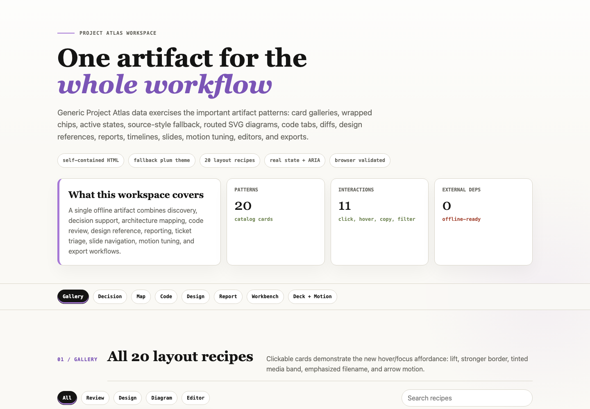

# make-html

`make-html` is a generic agent skill that pushes agents to produce self-contained HTML artifacts instead of long Markdown responses when the work deserves layout, visual hierarchy, diagrams, interactivity, or a shareable browser file.

It is designed for any agent that can read local skill instructions. The skill is not tied to a specific agent runtime.

Inspired by [The unreasonable effectiveness of HTML](https://thariqs.github.io/html-effectiveness/), with additional rules for source-style extraction, wrapping controls, routed diagrams, real selected states, and browser validation.



## What It Does

Use `make-html` when a response should become a usable artifact:

- Architecture maps and module explainers
- Implementation plans and specs
- PR reviews and reviewer writeups
- Research explainers and concept demos
- Status reports and incident timelines
- Design-system references and component sheets
- Flowcharts, SVG figure sheets, and slide decks
- Throwaway editors for triage, config, prompts, or prioritization

The skill tells the agent to create one offline-ready `.html` file with inline CSS and JavaScript by default. It favors visual structure over prose walls: tables for comparisons, SVG for diagrams, tabs for code examples, cards for repeated items, and export buttons for editor-style artifacts.

## Install

Clone the repo and copy the skill directory into your agent skills root:

```sh
git clone https://github.com/fuller-stack-dev/make-html.git
mkdir -p ~/.agents/skills
cp -R make-html/make-html ~/.agents/skills/
```

After install, the skill entrypoint should be:

```text
~/.agents/skills/make-html/SKILL.md
```

If your agent uses a different skills directory, copy the `make-html/` folder there instead.

## Usage

Ask for substantial deliverables normally. The skill description is intentionally broad so an agent can choose HTML without you spelling it out every time.

```text
Review this pull request and create an artifact reviewers can scan quickly.
```

Expected output: a self-contained PR review page with findings, file map, annotated diffs, severity labels, and next actions.

```text
Explain the plugin system in this repository with a module map and call path.
```

Expected output: an HTML explainer with an SVG architecture diagram, entry points, hot path, gotchas, and source references.

```text
Turn this migration plan into something an implementer can work from.
```

Expected output: a plan artifact with milestones, data flow, API/code snippets, risks, validation steps, and non-goals.

```text
Make me a small editor for triaging these tickets into Now, Next, Later, and Cut.
```

Expected output: a browser-based board with drag/click movement and a "Copy as Markdown" export.

## Design Behavior

The skill makes three styling decisions in order:

1. **Use source style first.** If the artifact is about a product, repo, docs site, or brand, inspect its CSS variables, token files, components, screenshots, or docs styling before designing.
2. **Use the fallback theme when no source style exists.** The default theme is editorial: ivory paper, slate text, serif display headings, mono labels, thin borders, wrapped pill controls, and light plum accents.
3. **Validate what the browser actually renders.** For nontrivial artifacts, check self-containment, JavaScript output, selected states, and narrow viewport behavior.

The fallback theme deliberately avoids horizontal scrolling for chip-like controls. Jump links, filter chips, segmented controls, badges, button groups, tag rows, and legends must wrap. Code blocks, diffs, dense tables, and large diagrams may scroll inside bounded containers.

## Custom Themes

Users can save reusable themes inside the installed skill:

```text
~/.agents/skills/make-html/themes/<theme-name>.md
```

Start from the bundled template:

```sh
cp ~/.agents/skills/make-html/themes/theme-template.md ~/.agents/skills/make-html/themes/calm-ops.md
```

A theme is a plain Markdown file with optional frontmatter:

```markdown
---
name: calm-ops
description: Compact operational dashboard theme for status pages and internal tools.
tags: dashboard, status, incident, ops
default: true
---
```

When generating an artifact, the skill uses this styling order:

1. Source/project style from the target repo, product, docs, or brand
2. Explicitly requested saved theme, such as "use the calm-ops theme"
3. Saved theme with `default: true`, or a clearly matching saved theme
4. Built-in fallback theme

Custom themes can define tokens, typography, layout density, component rules, code block styling, diagram styling, hover/focus/selected states, and an avoid list. They still inherit the universal `make-html` requirements: self-contained HTML, wrapped chips, real selected state, bounded diagrams, responsive layout, and browser validation.

The repo ignores personal files under `make-html/themes/*.md` except for the bundled template and built-in fallback theme, so local themes are not accidentally committed from a clone.

## Included References

The installable skill lives in [`make-html/`](make-html/):

- [`SKILL.md`](make-html/SKILL.md): trigger description, posture, workflow, and universal requirements
- [`references/recognition.md`](make-html/references/recognition.md): when to choose HTML instead of chat or Markdown
- [`references/artifact-patterns.md`](make-html/references/artifact-patterns.md): common artifact families and structures
- [`references/example-layout-catalog.md`](make-html/references/example-layout-catalog.md): page-by-page recipes for the 20 HTML-effectiveness examples
- [`references/custom-themes.md`](make-html/references/custom-themes.md): how to discover, apply, and save reusable themes
- [`references/interaction-patterns.md`](make-html/references/interaction-patterns.md): tabs, filters, editors, exports, and selected-state rules
- [`references/source-style.md`](make-html/references/source-style.md): how to extract style from an existing project
- [`references/validation.md`](make-html/references/validation.md): static, browser, interaction, responsive, and screenshot checks
- [`references/visual-quality.md`](make-html/references/visual-quality.md): typography, layout, diagrams, code blocks, and taste defaults
- [`themes/fallback-theme.md`](make-html/themes/fallback-theme.md): built-in fallback theme when no source style exists
- [`themes/theme-template.md`](make-html/themes/theme-template.md): starter file for personal saved themes

## Example Artifacts

This repo includes two self-contained HTML artifacts that demonstrate the skill guidance:

### Feature showcase

- [`examples/feature-showcase.html`](examples/feature-showcase.html)
- [`examples/images/feature-showcase-preview.png`](examples/images/feature-showcase-preview.png)
- [`examples/images/feature-showcase-board-preview.png`](examples/images/feature-showcase-board-preview.png)
- [`examples/images/feature-showcase-mobile-preview.png`](examples/images/feature-showcase-mobile-preview.png)

The showcase uses generic Project Atlas data to exercise the broad artifact surface:

- Card gallery with real links, hover/focus states, filters, and selected detail
- Routed SVG architecture map with bounded fit
- Tabbed code examples, diff blocks, collapsible notes, and copy controls
- Compact token swatches and component states
- Status report, trend chart, and timeline
- Kanban workbench with drag/drop, click fallback, lane counts, estimates, and Markdown export
- Slide deck with previous/next arrow buttons, left/right keyboard navigation, synced progress, and motion tuning controls
- Mobile behavior without page-level horizontal overflow

## Prompt Examples

Use these prompts directly with an agent that has the skill installed:

```text
Create a self-contained HTML implementation plan for adding SSO. Include milestones, data flow, risky files, rollback, and validation.
```

```text
Review this diff as an HTML artifact. Put blocking findings first, annotate the exact code, and add a reviewer focus map.
```

```text
Explain how rate limiting works in this repo. Build a skim-first feature explainer with a TL;DR, request path, tabs for config/code examples, and an FAQ.
```

```text
Create a component variant sheet for this Button component. Show size, intent, loading, disabled, focus, long text, and narrow-width states.
```

```text
Build a one-file HTML prompt tuner. Let me edit the prompt template, switch between sample inputs, preview rendered outputs, and copy the final prompt.
```

```text
Use my calm-ops theme and create an incident report artifact from these notes.
```

```text
Save the styling from this artifact as a reusable make-html theme called quiet-lab.
```

## Notes For Agents

When using this skill, do not wrap Markdown-shaped content in HTML. Use the browser as the medium:

- If information is comparable, align it.
- If it is spatial, draw it.
- If it changes state, make it interactive.
- If a user will reuse output, add a copy/export path.
- If controls look selectable, make selected state real.

The artifact should feel purpose-built for the task, not like a decorated document.
